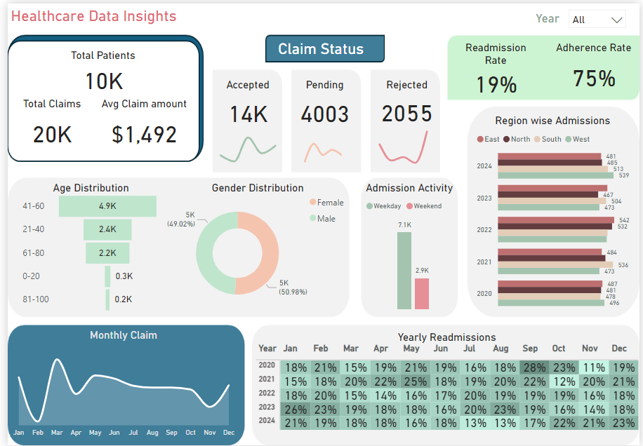

# **Healthcare Claims & Patient Analytics: Enhancing Operational Efficiency**

## **Project Summary**
This project focuses on analyzing healthcare claims and patient data to improve operational efficiency, monitor key metrics, and enhance compliance with healthcare regulations. By leveraging ETL pipelines, data integration techniques, and visual analytics, this analysis provides actionable insights into patient demographics, claim processing efficiency, and readmission trends. The goal is to inform strategic decisions to optimize healthcare delivery and improve patient outcomes.

---

## **Business Questions Addressed**
1. **What is the current claim processing efficiency?**
   - Insights into accepted, pending, and rejected claims.  
2. **How are patients distributed by demographic groups?**
   - Age and gender distribution of patients to identify key population segments.  
3. **What are the trends in readmission rates?**
   - Yearly and monthly readmission patterns to monitor patient care quality.  
4. **How does admission activity vary?**
   - Analyzing weekday vs. weekend admissions.  
5. **Which regions account for the highest admissions?**
   - Regional breakdown of patient admissions to allocate resources effectively.  

---

## **Data Overview**
- **Source**: Synthetic healthcare data (2020–2024).  
- **Key Features**: Patient demographics, claim details, admission activity, and readmission trends.  
- **Preparation**: ETL pipeline built with Azure Data Factory to process raw patient and claims data. Data cleaning and aggregation performed in Python.  

---

## **Key Business Metrics**
- **Total Patients**: 10K  
- **Total Claims**: 20K  
- **Average Claim Amount**: $1,492  
- **Claim Status**:  
  - **Accepted**: 14K  
  - **Pending**: 4,003  
  - **Rejected**: 2,055  
- **Readmission Rate**: 19%  
- **Adherence Rate**: 75%  

---

## **Analysis Summary**
1. **Claim Status**:
   - **Accepted Claims** represent 70% of total claims, indicating effective processing for most claims.  
   - **Pending Claims** (20%) and **Rejected Claims** (10%) highlight areas for improvement in documentation or claim validation processes.  

2. **Demographic Insights**:
   - Age group **41–60** accounts for the largest share of patients (49%), followed by **21–40** (24%) and **61–80** (22%).  
   - Gender distribution is nearly balanced: 50.98% female and 49.02% male.  

3. **Admission Activity**:
   - Weekday admissions dominate at **7.1K** compared to weekend admissions (**2.9K**), indicating higher operational load during weekdays.  

4. **Regional Trends**:
   - Consistent admission numbers across all regions (East, North, South, West), suggesting equal demand for healthcare services.  

5. **Readmissions**:
   - Readmission rates show a slight decline from 19% (2020) to 16% (2024), indicating improvements in patient care management.  

6. **Seasonal Patterns**:
   - Peak claims occur in **March** and **November**, while claims dip in **July** and **August**.  

---

## **Recommendations**
1. **Improve Claim Processing Efficiency**:  
   - Investigate causes for pending and rejected claims to reduce processing delays and rejections.  
   - Implement automated tools for claim validation to enhance accuracy.  

2. **Focus on High-Risk Demographics**:  
   - Tailor healthcare services to age groups **41–60** and **21–40**, as they represent the majority of patients.  
   - Address gender-specific healthcare needs to ensure equitable outcomes.  

3. **Enhance Weekend Operations**:  
   - Allocate additional resources for weekend admissions to reduce bottlenecks.  

4. **Leverage Regional Data**:  
   - Use regional insights to deploy targeted healthcare campaigns and resource allocation.  

5. **Sustain Readmission Improvements**:  
   - Focus on post-discharge follow-up care to maintain declining readmission trends.  

6. **Plan for Seasonal Peaks**:  
   - Increase staffing and inventory during high-claim months like March and November.  

---

## **Tools and Technologies**
- **Data Integration**: Azure Data Factory for ETL pipelines.  
- **Data Analysis**: Python (Pandas, NumPy).  
- **Visualization**: Power BI Dashboard.  
- **Compliance**: Data masking and governance practices for HIPAA compliance.  

---

## **Next Steps**
1. Introduce predictive modeling to forecast claims and readmission risks.  
2. Automate operational dashboards for real-time monitoring.  
3. Expand data analysis to include additional metrics like patient satisfaction and treatment outcomes.
